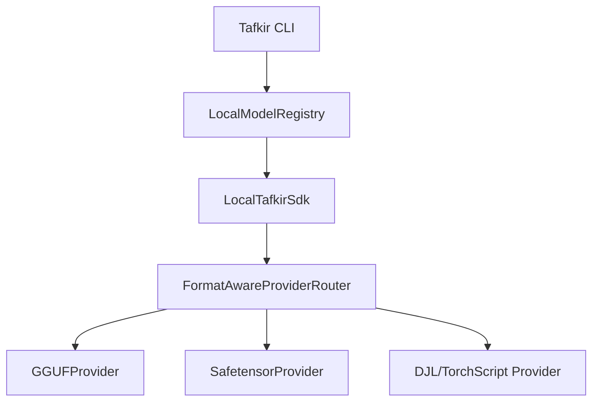

# Tafkir CLI - Model Inference & Management Tool

**Note**: The Tafkir CLI evolved from the Gollek inference/serving engine platform. While Gollek continues as a standalone inference/serving engine, Tafkir CLI is now integrated into the Tafkir training framework to provide end-to-end ML workflows—from training to deployment.

Production-ready CLI similar to modern LLM CLIs, integrating with various providers and model registry.

## v0.1.4 Enhancements: Dual-Format Serving

The Tafkir CLI now supports **Dual-Format Serving**, allowing you to run both GGUF and SafeTensors models seamlessly.

### Key Features:
- **Format-Aware Routing**: The CLI automatically detects the model format (GGUF, SafeTensors, TorchScript) and routes to the appropriate provider.
- **Unified Model Registry**: All local models are now managed through a central `LocalModelRegistry`, improving discovery and consistency.
- **Enhanced SafeTensors Support**: Direct inference support for SafeTensors models (requires `tafkir-ext-runner-safetensor` extension).
- **GGUF Performance**: Optimized local inference via llama.cpp using Panama FFM API.

## Install (Release Artifacts)

Release workflow: `.github/workflows/gollek-cli-release.yml`

```bash
# macOS / Linux (curl installer)
curl -fsSL https://github.com/bhangun/tafkir/releases/latest/download/install.sh | bash
```

```bash
# Homebrew (after adding generated formula to your tap)
brew tap bhangun/tafkir
brew install tafkir
```

```powershell
# Chocolatey
choco install tafkir
```

```powershell
# Windows native executable
Invoke-WebRequest -Uri "https://github.com/bhangun/tafkir/releases/latest/download/tafkir-windows-x64.exe" -OutFile "tafkir.exe"
.\tafkir.exe --version
```

```powershell
# Windows JVM fallback package (Java 21+)
# Extract tafkir-jvm.zip first
.\bin\tafkir.bat --version
```


```bash
  _____       _      _    
 / ____|     | |    | |   
| |  __  ___ | | ___| | __
| | |_ |/ _ \| |/ _ \ |/ /
| |__| | (_) | |  __/   < 
 \_____|\___/|_|\___|_|\_\

Model: qwen2.5-7b-instruct-GGUF
Provider: gguf
Commands: 'exit' to quit, '/reset' to clear history.
Note: Use '\' at the end of a line for multiline input.
--------------------------------------------------

>>> Hello, what can you do?

Assistant: I can help you with coding, writing, and analysis...

[Tokens: 42, Duration: 0.85s, Speed: 49.41 t/s]

```

## Build with Gradle

```bash
# Build JVM artifact
./gradlew :tafkir-cli:quarkusBuild -x test

# Build all artifacts
./gradlew build -x test
```

## Build Native Executable

```bash
# Linux/macOS
./gradlew :tafkir-cli:buildNative -x test

# Windows
gradlew.bat :tafkir-cli:buildNative -x test
```

### Native Build Prerequisites

**Linux:**
```bash
sudo apt-get install -y build-essential libssl-dev zlib1g-dev pkg-config
```

**macOS:**
```bash
xcode-select --install
brew install openssl
```

**Windows:**
- Visual Studio Build Tools 2022+
- GraalVM JDK 25+

### Alternative: Disable UPX Compression

If you encounter UPX compression errors:

```bash
./gradlew :tafkir-cli:buildNative -x test -Dquarkus.native.compression.disable=true
```


> **Note**: The GGUF provider uses Panama FFM (Foreign Function & Memory API) to interface with llama.cpp. GraalVM native image requires explicit registration of foreign function calls via `reachability-metadata.json` in the `tafkir-ext-runner-gguf` module.

> **Note**: The GGUF converter also relies on Panama FFM (gguf_bridge). Ensure the `tafkir-gguf-converter` native library is available on your `java.library.path`, or via your packaged native resources when building native images.

## Goal

Create a fully functional CLI that supports:
- **Local inference** via GGUF adapter (llama.cpp)
- **Local Registry integration** for managed model downloads
- **Cloud providers** (Gemini, etc.)
- **Model management** (pull, list, show, delete)

## Architecture Overview



## Supported Providers

| Provider | Format Support | Description |
|----------|----------------|-------------|
| `gguf` | `.gguf` | Local GGUF models via llama.cpp |
| `safetensor` | `.safetensors`, `.bin` | Direct SafeTensors/PyTorch weights |
| `.pt`, `.pth` | TorchScript models |
| `gemini` | Cloud | Google Gemini |

## Commands

| Command | Description | Provider/Module |
|---------|-------------|-----------------|
| `tafkir run` | Run inference with a model | All providers |
| `tafkir pull` | Download model from registry | HuggingFace |
| `tafkir convert` | Convert a model to GGUF locally | GGUF Converter |
| `tafkir list` | List local models | LocalModelRepository |
| `tafkir show` | Show model details | LocalModelRegistry |
| `tafkir serve` | Start API server | All providers |
| `tafkir providers` | List available providers | ProviderRegistry |
| `tafkir chat` | Interactive chat session | All providers |

---


Production-ready CLI with full provider support.

## Usage Examples

### Auto-Detect and Run
```bash
# GGUF model
tafkir run --model qwen2.5-7b-instruct-GGUF --prompt "Hi"

# SafeTensors model
tafkir run --model hf:Qwen/Qwen2.5-0.5B-Instruct --prompt "Describe the moon."
```

### System Prompt, Tools, MCP, RAG, and Embeddings
```bash
# System prompt
tafkir run --model qwen2.5-7b-instruct-GGUF \
  --system "You are a concise Tafkir assistant." \
  --prompt "Summarize the installer profiles."

# OpenAI-style tool definitions or Tafkir ToolDefinition JSON
tafkir run --model qwen2.5-7b-instruct-GGUF \
  --tool-file ./tools.json \
  --tool-choice auto \
  --prompt "Use a tool if needed."

# MCP tool hints, optionally scoped as server/tool or server:tool
tafkir run --model qwen2.5-7b-instruct-GGUF \
  --mcp-tool filesystem/read_file \
  --prompt "Check the project README."

# Retrieval context from inline text and files. File context is ranked against each prompt.
tafkir chat --model qwen2.5-7b-instruct-GGUF \
  --rag-file ./docs/install.md \
  --rag-context "Prefer local install profiles when possible." \
  --embedding-model text-embedding-3-small

# Embeddings from text or file, with JSON output
tafkir embed --model text-embedding-3-small \
  --input-file ./docs/install.md \
  --json --output /tmp/tafkir-install-embedding.json
```

### Interactive Chat
```bash
tafkir chat --model llama-3.2-1b-instruct
```

### Convert to GGUF
```bash
tafkir convert --input ~/models/llama-2-7b --output ~/conversions --quant q4_k_m
tafkir convert --input ~/models/llama-2-7b --output ~/conversions --dry-run
tafkir convert --input ~/models/llama-2-7b --output ~/conversions --json
tafkir convert --input ~/models/llama-2-7b --output ~/conversions --json-pretty
```

```bash
# MCP registry: add server config once, then reuse
tafkir mcp add '{"mcpServers":{"image-downloader":{"command":"node","args":["/path/to/mcp-image-downloader/build/index.js"]}}}'
tafkir mcp add --name image-downloader --command node --args-json '["/path/to/mcp-image-downloader/build/index.js"]'
tafkir mcp add --from-url https://example.com/mcp-servers.json
tafkir mcp add --from-registry qpd-v/mcp-image-downloader
tafkir mcp add --from-registry https://mcpservers.org/servers/qpd-v/mcp-image-downloader
tafkir mcp add --from-url https://example.com/mcp-servers.json --server image-downloader
tafkir mcp add --list-from-registry --from-registry qpd-v/mcp-image-downloader
tafkir mcp add --list-from-registry --from-url https://example.com/mcp-servers.json
tafkir mcp list
tafkir mcp show image-downloader
tafkir mcp show image-downloader --json
tafkir mcp doctor
tafkir mcp test image-downloader
tafkir mcp test --all
tafkir mcp edit image-downloader --command node --args-json '["/new/path/index.js"]'
tafkir mcp disable image-downloader
tafkir mcp enable image-downloader
tafkir mcp rename image-downloader image-fetcher
tafkir mcp export --file /tmp/mcp-servers.json
tafkir mcp import --file /tmp/mcp-servers.json --merge
tafkir mcp import --file /tmp/mcp-servers.json --replace
tafkir mcp remove image-downloader

# Optional enterprise mode: use centralized MCP registry API (DB-backed) instead of local ~/.tafkir/mcp/servers.json
TAFKIR_ENTERPRISE_ENABLED=true \
TAFKIR_MCP_REGISTRY_MODE=remote \
TAFKIR_MCP_REGISTRY_API_BASE_URL=http://localhost:8080 \
TAFKIR_MCP_REGISTRY_API_TOKEN=<jwt-or-bearer-token> \
TAFKIR_TENANT_ID=<tenant-id> \
tafkir mcp add '{"mcpServers":{"image-downloader":{"command":"node","args":["/path/to/mcp-image-downloader/build/index.js"]}}}'

TAFKIR_ENTERPRISE_ENABLED=true \
TAFKIR_MCP_REGISTRY_MODE=remote \
TAFKIR_MCP_REGISTRY_API_BASE_URL=http://localhost:8080 \
TAFKIR_MCP_REGISTRY_API_TOKEN=<jwt-or-bearer-token> \
TAFKIR_TENANT_ID=<tenant-id> \
tafkir mcp remove image-downloader

# Then run using provider mcp (local model lookup is skipped for --provider mcp)
tafkir run --provider mcp --model any --prompt "hello"

# Build
./gradlew :tafkir-cli:quarkusBuild -x test

# List providers
java -jar tafkir-cli/build/quarkus-app/quarkus-run.jar providers

java -jar tafkir-cli/build/quarkus-app/quarkus-run.jar run --provider gguf --model Qwen/Qwen2.5-0.5B-Instruct --prompt "Hello"

java -jar tafkir-cli/build/quarkus-app/quarkus-run.jar run --provider gguf --model Qwen/Qwen2.5-0.5B-Instruct --prompt "Explain quantum entanglement in 2 sentences."


java -jar tafkir-cli/build/quarkus-app/quarkus-run.jar chat --provider gguf --model Qwen/Qwen2.5-0.5B-Instruct 

# Minimal output mode (recommended for native GGUF)
java -jar tafkir-cli/build/quarkus-app/quarkus-run.jar chat --provider gguf --model Qwen/Qwen2.5-0.5B-Instruct --quiet

java -jar tafkir-cli/build/quarkus-app/quarkus-run.jar chat --provider gguf --model Qwen/Qwen2.5-0.5B-Instruct 


java -jar tafkir-cli/build/quarkus-app/quarkus-run.jar chat --model google-t5/t5-small

java -jar tafkir-cli/build/quarkus-app/quarkus-run.jar chat --model HuggingFaceTB/SmolVLM-256M-Instruct

HuggingFaceTB/SmolLM2-135M
meta-llama/Llama-3.2-1B
google/gemma-2b-it


GGUF_GPU_ENABLED=true GGUF_GPU_LAYERS=-1 GGUF_BATCH_SIZE=1024 \
GGUF_THREADS=8 \
java -jar tafkir-cli/build/quarkus-app/quarkus-run.jar \
chat --model meta-llama/Llama-3.2-1B-Instruct

# Run with different providers
java -jar tafkir-cli/build/quarkus-app/quarkus-run.jar run \
  --provider openai --model gpt-4 --prompt "Hello"

java -jar tafkir-cli/build/quarkus-app/quarkus-run.jar run \
  --provider anthropic --model claude-3-opus --prompt "Hello"

java -jar tafkir-cli/build/quarkus-app/quarkus-run.jar run \
  --provider cerebras --model llama-3.1-8b --prompt "Hello"
```

```bash
tafkir-cli % java -jar tafkir-cli/build/quarkus-app/quarkus-run.jar providers
ID              NAME                 VERSION    STATUS    
------------------------------------------------------------
cerebras        Cerebras             1.0.0      HEALTHY   
gemini          Google Gemini        1.0.0      HEALTHY   
gguf            GGUF Provider (ll... 1.1.0      HEALTHY   
libtorch        LibTorch/TorchScript 1.1.0      HEALTHY   
mistral         Mistral AI           1.0.0      HEALTHY   
 

6 provider(s) available
```

### Run native
```bash
./tafkir-cli/build/tafkir-cli-runner chat --provider gguf --model Qwen/Qwen2.5-0.5B-Instruct  
```

### Native smoke check
```bash
./scripts/native-gguf-smoke.sh Qwen/Qwen2.5-0.5B-Instruct
```

If the native executable cannot find `llama.cpp` libraries, point it explicitly:

```bash
export TAFKIR_LLAMA_LIB_DIR=/absolute/path/to/native-libs
# or:
export TAFKIR_LLAMA_LIB_PATH=/absolute/path/to/libllama.dylib
```

To enable file logging explicitly:
```bash
export TAFKIR_CLI_FILE_LOG=true
export TAFKIR_CLI_LOG_FILE="$HOME/.tafkir/logs/cli.log"
```


```bash
# First run - downloads
$ tafkir run --model Qwen/Qwen2.5-0.5B-Instruct --prompt "Hi"
Checking model: Qwen/Qwen2.5-0.5B-Instruct... not found locally.
Attempting to download from Hugging Face...
Downloading: ████████████████████ 100% (468/468 MB)
✓ Model saved to: ~/.tafkir/models/gguf/Qwen_Qwen2.5-0.5B-Instruct-GGUF
Model path: ~/.tafkir/models/gguf/Qwen_Qwen2.5-0.5B-Instruct-GGUF
[inference output]

# Second run - uses existing
$ tafkir run --model Qwen/Qwen2.5-0.5B-Instruct --prompt "Hi"
Checking model: Qwen/Qwen2.5-0.5B-Instruct... found local variant: Qwen/Qwen2.5-0.5B-Instruct-GGUF
Model path: ~/.tafkir/models/gguf/Qwen_Qwen2.5-0.5B-Instruct-GGUF
[inference output]

# Using custom path
$ tafkir run --model-path /my/models/custom.gguf --prompt "Hi"
Using model from: /my/models/custom.gguf
[inference output]

# Ctrl+C - exits immediately
$ tafkir run --model Qwen/Qwen2.5-0.5B-Instruct --prompt "Hi"
Downloading: ████░░░░░░░░░░░░░░░░ 20% (94/468 MB)^C
✗ Download cancelled
```

## Build and Run
java -jar tafkir-cli/build/libs/tafkir-cli-runner.jar chat -m <model> --session

```

```bash
# Interactive chat with session (KV cache enabled)
tafkir chat --model Qwen/Qwen2.5-0.5B-Instruct --session

# Chat with function calling model
tafkir chat --model <tool-model> --session
# Then type: "What's the weather in Jakarta?"
# Output: [Tool Call] get_weather({"city": "Jakarta"})
```

## Technical Details

The CLI leverages a centralized `tech.kayys.tafkir.spi.model.LocalModelRegistry` to scan and index models across multiple root directories:
- `~/.tafkir/models/gguf`
- `~/.tafkir/models/safetensors`
- `~/.tafkir/models/libtorchscript`

Format detection is performed via magic bytes (ModelFormatDetector) to ensure reliable provider routing regardless of file extension.
a
